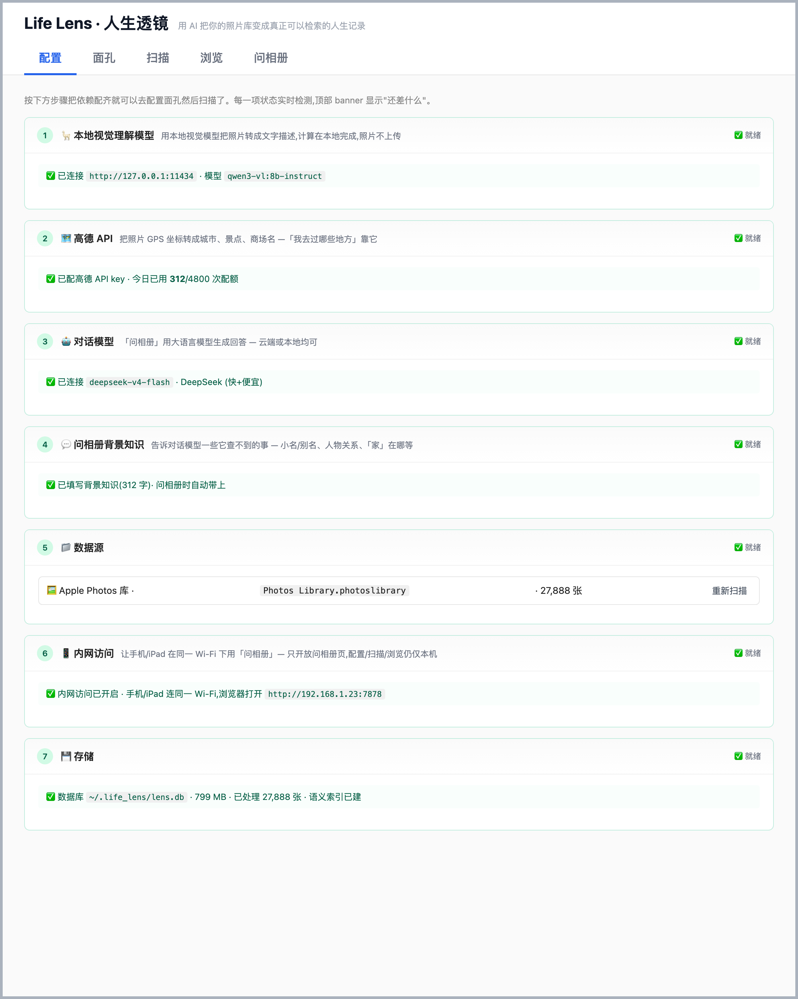
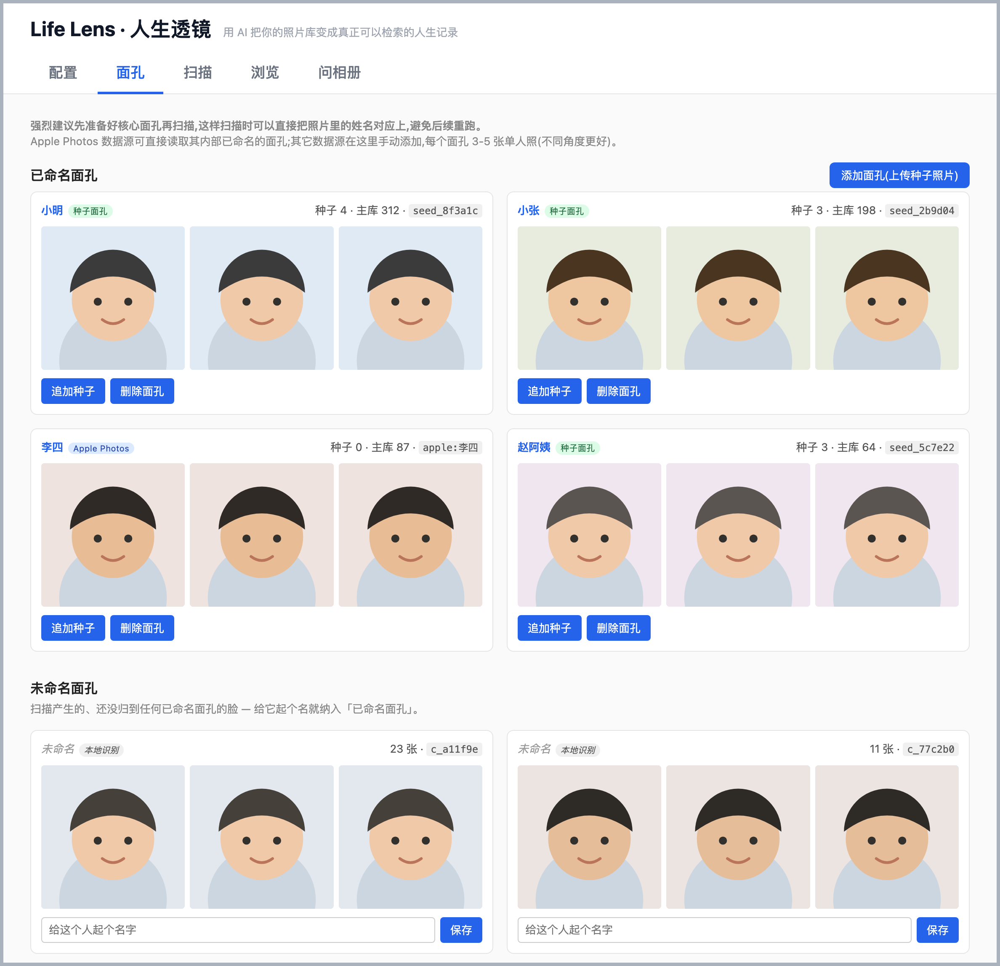
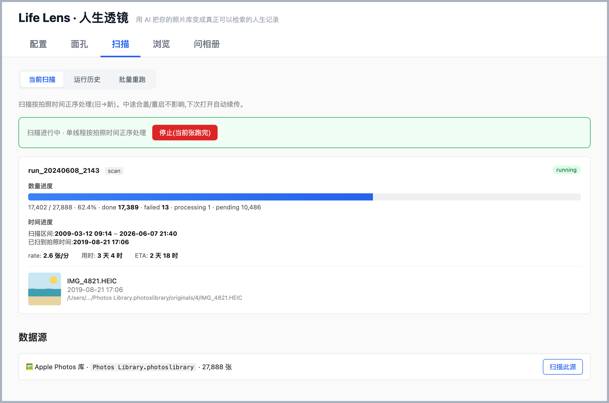
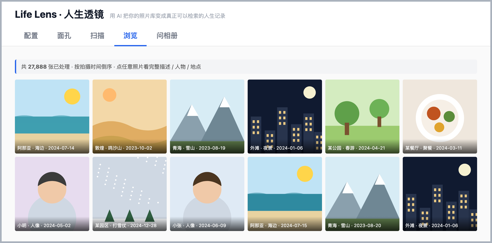
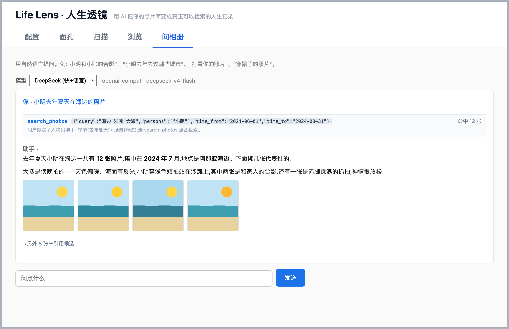
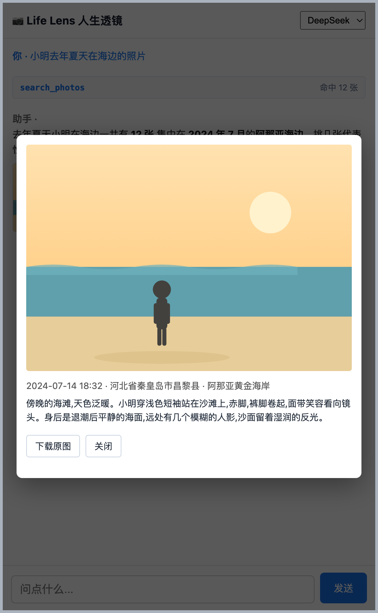

# Life Lens · 人生透镜

> 用 AI 把你的照片库变成真正可以检索的人生记录。

照片库里几万张照片，绝大多数你这辈子再也不会回看。但它们记录着真实的"你"—— 去过的地方、见过的人、那一年的样子、那次旅行的天气。

Life Lens 在**本地**用视觉模型把每张照片读一遍，提取出场景、人物、动作、地点、心情等结构化信息，存进一个可查询的本地数据库。然后你可以用自然中文问它：

- "我今年去过哪些城市？"
- "海边的照片"
- "去年冬天和家人吃火锅的那次"
- "穿红衣服的子涵"

它会理解、检索、把对应的照片找出来给你看。

## 隐私设计

照片是极其私人的东西。这个项目从第一行代码就为"不外发原图"设计：

| 数据类型 | 能否外发 | 谁会接到 |
|---|---|---|
| **原图字节**(JPEG/HEIC/视频/缩略图) | ❌ **绝对不行** | 永远只在你本机 |
| **照片识别结果**(描述/人物/标签) | ❌ 默认不外发 | 存在本机 SQLite |
| GPS 数字(单独的经纬度) | ✅ 可以 | 高德地图反编码(只为拿城市/景点名) |
| 你的提问文本 | ✅ 可以 | 你选的对话模型(自己填的 API key) |
| 查询结果的精简描述(给模型回答用) | ✅ 可以 | 你选的对话模型 |

判断标准：**外发的数据能否让接收方还原出"这是哪张照片"**?GPS 单独发不行，但 GPS + 时间 + 缩略图组合就能 → 所以缩略图字节永远不外发。

**视觉理解全程在本地**：用 [Ollama](https://ollama.com/) 跑开源视觉模型(`qwen3-vl:8b-instruct`)，约 5GB，装好后没有网络也能工作。

**配置文件含 API key**:`~/.life_lens/config.json` 会被自动 `chmod 600`，不进任何 git 仓库。

## 怎么用

### 一行命令装好

```bash
curl -fsSL https://raw.githubusercontent.com/uxtracer/life-lens/main/install.sh | bash
```

这条命令会克隆代码 → 建 Python 虚拟环境 → 装依赖(约 700MB) → 启动服务 → 自动打开浏览器。

> 如果不放心 `curl | bash`，可以先 `curl -O https://raw.githubusercontent.com/uxtracer/life-lens/main/install.sh && less install.sh && bash install.sh`，看一眼内容再跑。

### 浏览器打开后

进入 `http://127.0.0.1:7878`，默认是**配置 tab**，有 8 张卡片(按推荐顺序):

1. **🦙 本地视觉理解模型** —— 装 Ollama 拉 `qwen3-vl:8b-instruct` 模型(卡片里有官方链接和命令)。
2. **🗺 高德 API** —— 把 GPS 坐标转成城市和地点名(免费 5000 次/天，链接里有申请步骤)。
3. **🤖 对话模型** —— 任何兼容 OpenAI `/v1/chat/completions` 格式的服务(推荐 DeepSeek 的 v4-flash，性价比好；OpenAI、Together、本地 Ollama 都行)。
4. **💬 问相册背景知识** —— 可选填写人物别名、关系及常用地点等背景。
5. **📁 数据源** —— 添加本地图片目录或Apple Photos图库。读取Photos图库前,在「系统设置→隐私与安全性→完全磁盘访问权限」中开启启动Life Lens的程序(通常是Terminal/iTerm,从Codex启动则是Codex),无需授权Ollama;重启该程序和`lens serve`后再添加图库。
6. **📱 内网访问** —— 可选开放同一局域网内的移动端「问相册」。
7. **🖼️ 智能相框** —— 可选开启独立的只读轮播接口。
8. **💾 存储** —— 查看数据库、缓存和语义索引状态。

依赖配齐后，顶部 banner 就会消失，可以开始用了。

### 之后的流程

1. **面孔 tab** —— 强烈建议先添加你常出现的家人朋友的种子照片(每人 3-5 张正脸，不同角度)。这样扫描出来的照片描述里直接带姓名，事后不用重跑。扫描遗漏的人脸可在「未命名面孔」中并入已有姓名,包括Apple Photos提供的待命名脸。
2. **扫描 tab** —— 选数据源，点开始。按拍照时间正序处理。中途合盖、关电脑都不影响，下次自动续传。
3. **浏览 tab** —— 看扫描结果，点开看大图和完整识别信息。
4. **问相册 tab** —— 自然中文提问，模型会自动选合适的查询方式找照片给你看。手机 / iPad 连同一 Wi-Fi 也能用「问相册」(在配置页「内网访问」打开)。

**扫描速度**：单张约 20 秒(M 系列 Mac，含两次视觉模型调用、人脸识别、EXIF、地点反编码)。一万张大概两天合盖待机能扫完。

### 界面一览

> 以下界面图均为占位演示数据(示意用插画缩略图、占位人名 / 公共景点)，不含真实照片。

**配置 —— 依赖全部就绪**



**面孔 —— 已命名 / 未命名面孔聚类**



**扫描 —— 实时进度(数量 / 时间双进度 + 当前处理张)**



**浏览 —— 缩略图网格(角标显示地点 / 时间)**



**问相册 —— 提问 + AI 回答 + 配图**



**问相册(移动端)—— 点开照片看大图与完整地址**



## 设计思路

### 总体架构

```
照片源(本地目录 / Apple Photos)
    ↓
扫描流水线(单进程，按拍照时间正序)
    ├─ EXIF 抽取(时间 + GPS)
    ├─ 预处理(HEIC → JPEG 1024px，缓存)
    ├─ 人脸识别(InsightFace，匹配到种子人物)
    ├─ 视觉理解(本地 Ollama qwen3-vl 8b，两次调用)
    │     ├─ 第 1 次：写一段中文描述，带真实姓名
    │     └─ 第 2 次：输出结构化字段(场景/物品/动作/标签)
    ├─ 高德反编码(GPS → 城市/POI)
    └─ 写 SQLite + 语义向量
        ↓
查询层(FTS5 全文 + 向量 + 时间 + 人物 RRF 混合检索)
    ↓
对话模型(LLM)
    ├─ 第 1 轮：选工具 + 填参数(不写 SQL)
    └─ 第 2 轮：看检索结果，流式生成中文回答
        ↓
浏览器 GUI(原生 HTML/JS，无前端框架)
```

### 几个关键决策

**视觉模型本地跑，LLM 文本调用走 API**

视觉模型对一张图的处理涉及"看到了什么"的所有信息，必须本地。但相册问答时，LLM 只需要看少量精简描述就能回答，这部分用云端便宜的 API 性价比远高于本地大模型。两个分开。

**视觉理解拆两次调用，而不是一次写全部**

8B 模型 instruction following 较弱，把"描述 + 结构化字段 + 人物约束 + JSON schema"塞到一个 prompt 里会让模型注意力分散，真名约束会被忽略。拆成"先写描述、再写结构化"两次调用，每次专注一件事。实测速度只多 10-20%(Ollama 同张图的第二次调用 image tokens 缓存命中)，但质量稳定得多。

**LLM 不写 SQL，只填白名单参数**

对话页让 LLM 充当"工具调度器"：给它三个工具(`search_photos` / `places_visited` / `counts_by_year`)，让它输出 JSON 选哪个工具、填哪些参数(关键词、时间窗、人物名、地点)。Python 拿到 JSON 后拼 SQL。

为什么不让 LLM 直接出 SQL?**安全可控**。LLM 写 SQL 容易幻觉表名字段，容易拼出注入风险，容易写出全表扫描的慢查询。白名单参数化让所有路径可审计。

**hybrid 检索：字面 + 语义 + 时间 + 人物 RRF**

光靠字面匹配(FTS5)在中文短词查询里召回差(例如查"裙子"匹配不到描述里写"连衣裙"的照片)。光靠语义向量(bge-small-zh)精确率又不够(短查询对长文档余弦相似度低)。两路并跑，LLM 还会自动给关键词扩展近义词("裙子" → ["连衣裙", "长裙", "短裙"])，所有路径用 RRF(Reciprocal Rank Fusion)合并，最后按时间排序。

**人脸用 max-pooling 而不是均值聚类**

同一个人不同年龄、不同光照、不同角度差异巨大。如果用均值 centroid 来代表"这个人"，会被多张种子图平均成一个"四不像"。改用 max-pooling：新照片的脸跟 cluster 内每张种子分别算相似度，取最高的那个。这样跨年龄的种子图反而是优势 —— 新脸总能匹到最相近的那张。

**人物名字改了不重跑视觉模型**

视觉描述里写"张三举着相机自拍"是 LLM 当时输出的死字符串。但所有结构化字段(谁、什么动作)都用 `cluster_id` 锚定，查询时实时 join 当前姓名表。这样改名、补种子是秒级操作，不需要重跑几小时的视觉模型。代价是描述文本里旧名会残留(用户可以选择性地手动触发重跑)。

**所有派生字段(时间桶、地点桶、照片类型)用 Python 规则**

视觉模型只产"原始素材"(描述、场景、物品、标签、心情)。所有桶化(年/季节/星期、家/旅行、自拍/美食/宠物)都是 Python 规则现算。改分类规则不需要重跑模型，几分钟刷一遍十万张。

### 不做什么

- **不做 markdown 导出** —— 几十万行文本不是给人看的格式。这个项目用 SQLite 做单一事实源，markdown 派生品你可以自己脚本生成。
- **不做视频** —— Phase 4 之后再说。当前白名单只含图片格式(JPG、HEIC、PNG、WebP 等)。
- **不做云同步** —— 数据完全本地。要备份就用项目自带的 `lens backup` 或 `scripts/backup_to_icloud.py`。
- **不直接外发原图** —— 见上面隐私表。

## 系统要求

- **macOS** 或 **Linux**(主开发环境是 macOS;Linux 缺 Apple Photos 数据源，其他功能全可用)
- **Python ≥ 3.9**
- **磁盘**：大概 6GB(Ollama 模型 5GB + InsightFace 约 300MB + 语义向量约 95MB + 预处理缓存约 50KB/张)
- **RAM**:16GB 起；InsightFace、Ollama、fastembed 同时跑时高峰约 10GB

## 高级

### 命令行

`lens` 命令装在虚拟环境里,用之前先进安装目录激活 venv(install.sh 默认装到 `~/life-lens/`):

```bash
cd ~/life-lens                # install.sh 默认目录(LIFE_LENS_HOME 可改)
source .venv_lens/bin/activate
```

激活后:

```bash
lens                          # 默认启动 web GUI + 自动开浏览器
lens serve --no-browser       # 只起服务,不开浏览器
lens serve --port 7878        # 指定端口
lens scan <path>              # 命令行扫描(也可以在 web GUI 里扫)
lens status --jobs            # 看任务状态、最近 5 个 Run、失败原因
lens backup                   # WAL-safe 数据库快照
lens update                   # 升级到最新版(拉代码 + 装依赖 + 重启 server)
```

不想激活 venv 也可以直接用全路径:`~/life-lens/.venv_lens/bin/lens serve`。

### 升级到新版

二选一:

```bash
# A) 已装好的环境里:一行搞定
lens update

# B) 直接重跑安装脚本(等价 A,但会先 git pull 整个仓库)
curl -fsSL https://raw.githubusercontent.com/uxtracer/life-lens/main/install.sh | bash
```

两条命令都会:`git pull` → `pip install -e .` → kill 旧 server → 起新 server,跑完浏览器刷新就是新版。db 和 config(`~/.life_lens/`)不动。

### 多账号 / 多 root 并行

```bash
lens --root ~/.life_lens_work serve --port 7879
```

不同的 `--root` 完全隔离 db 和 config，可以同时跑多套(适合家庭照片和工作照片分开管理)。

### 重跑某些字段

视觉描述效果不好？改了 prompt 想重新生成？web 的"扫描 / 批量重跑"页可以按各种条件(时间、字段缺失、人物、关键词)选出子集重跑某个阶段(vision / derived / faces)。

## 开发 / 贡献

- 私有开发主仓：作者本人的 monorepo(不公开)。
- **公开仓**(本仓库):https://github.com/uxtracer/life-lens
- 双向不同步 —— 公开仓的 PR 我会手动 cherry-pick 回私有仓。
- 欢迎 issue 和 PR。

测试：

```bash
source .venv_lens/bin/activate
pytest tests/ -v          # 46 个 A 层测试，无外部依赖，几秒跑完
```

## License

[MIT](./LICENSE)

---

如果这个项目对你有帮助，欢迎 star ⭐ 让更多人看到。
